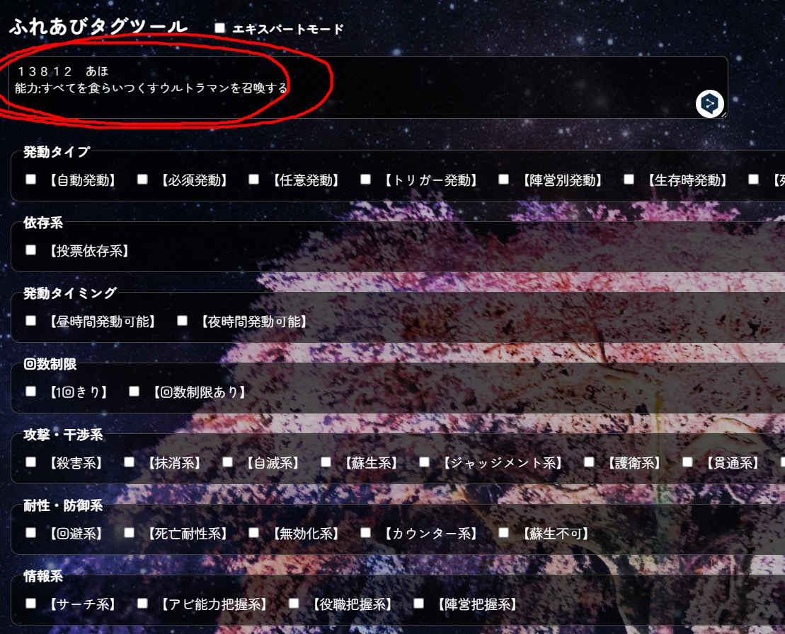
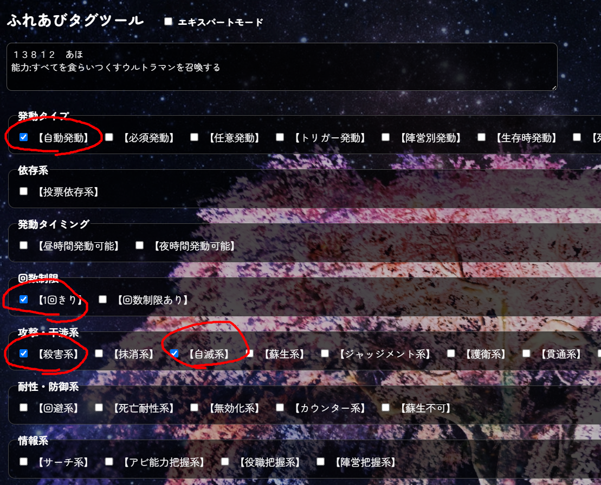
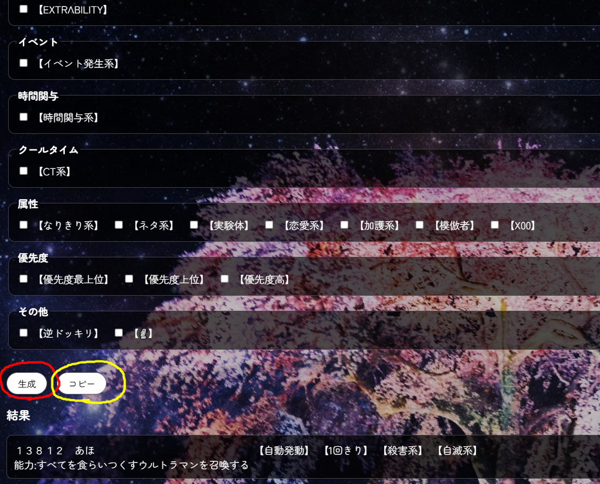
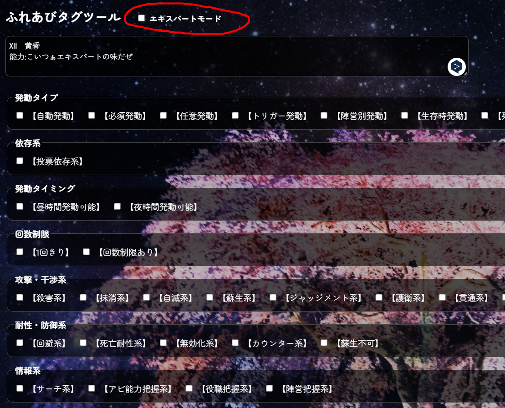
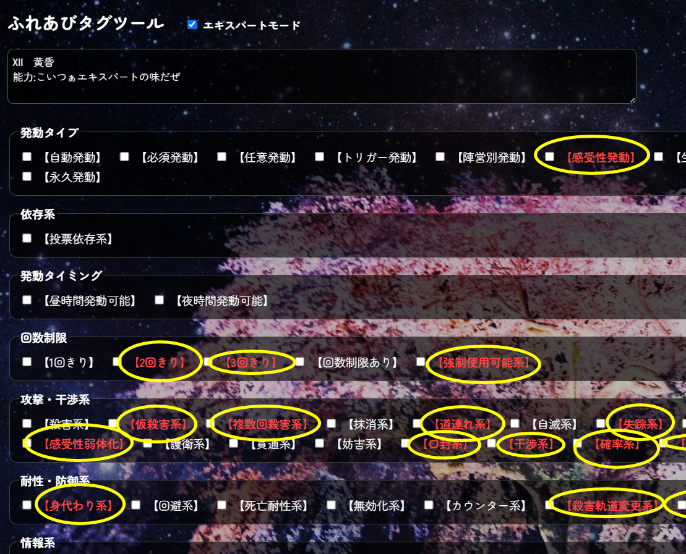
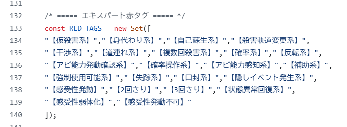
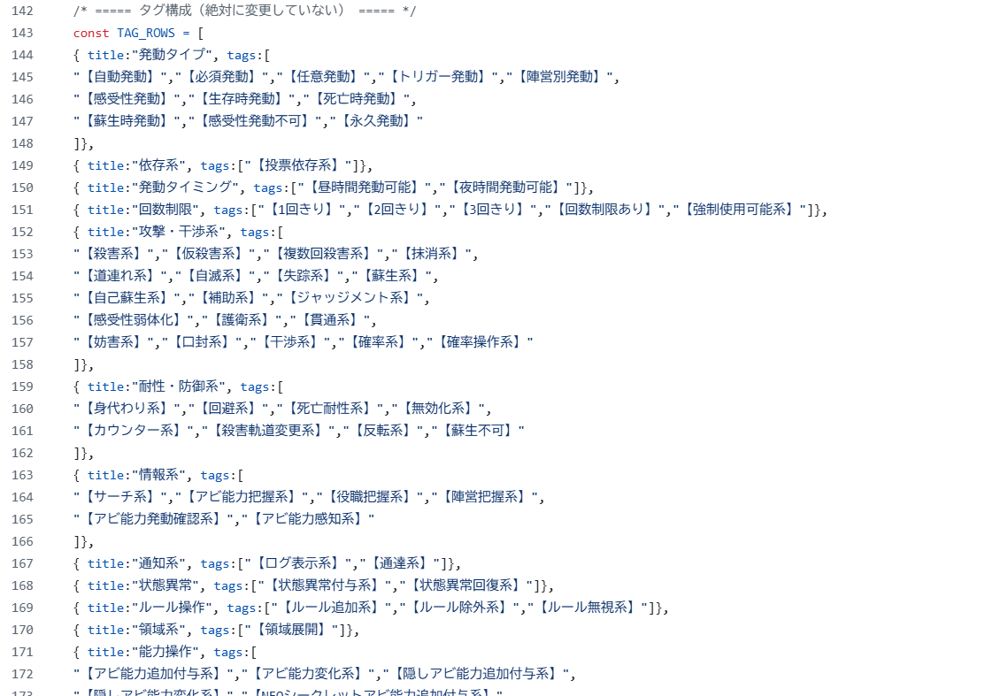
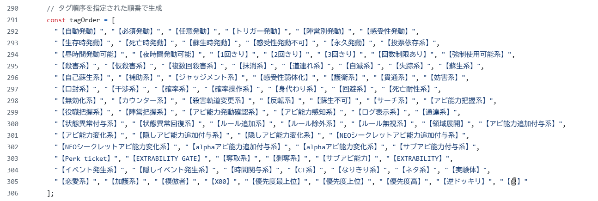

# ふれあびたぐつーる
 
ばーじょん２！ってわけです、ぴすぴす 
れあｄめ。ｍｄ 
【急募】いい感じの背景書いてくれる人いませんか() 
↑新しいタグじゃないよ！ 
これは製作者自身がタグ多すぎてタグの順番がバラバラになるかrチャッピーに頼んで作ってもらったやつです 
チェックボックス押すとタグが順番通りに追加されますです 
まじでこれ作ってよかったなって思ってるよ！ 
 
たぐつーるのはいけいのそーす→　https://commons.nicovideo.jp/works/nc175412  
 
 
## おつむ弱者でもわかるたぐつーるの使い方
### その１
 
テンプレートに沿って入力！↓てんぷれ 
アビ番号(ふれあび製作者以外なら任意)　能力名 
能力:(能力の内容) 
### その2
 
能力に該当するタグにチェック！(タグの説明は後日書いておきますね) 
### その3
 
全部整ったら生成を押す！そのままだと表示が崩れてるのでコピーボタンを押してどっかメモ帳かなんかに張り付ける！ 
### 番外1
 
EXTRΛBILITYは少し作るのがだるいです 
### 番外2
 
EXTRΛBILITYは廃止されたタグを使うのでエキスパートモードをオンにしてエキスパートタグ(?)をつけましょう！ 
簡単だね！ 
 
## ふれあび派生を作る場合
現在無許可でクロス版が作られてたりするわけですが(黙認) 
許可取れば通すのに 
 
そういう派生には新たなタグがあるでしょう 
そういう時はこれをフォークしてください！ 
タグの追加の仕方も教えましょう！ 
### その1
 
ここにタグを入れるとエキスパートモードの時にしかチェックボックスが表示されなくなるよ！ 
### その2
 
ここでカテゴリの追加やタグの追加ができますがその3を要参照 
### その3
 
これは生成時にタグを順番通り整列させるものです、その2で追加したタグはここにも書いておかないと生成時にせっかく追加したタグが生成されないので気をつけろ！ 
 
他何か質問あったら答えます～ﾉｼ 
